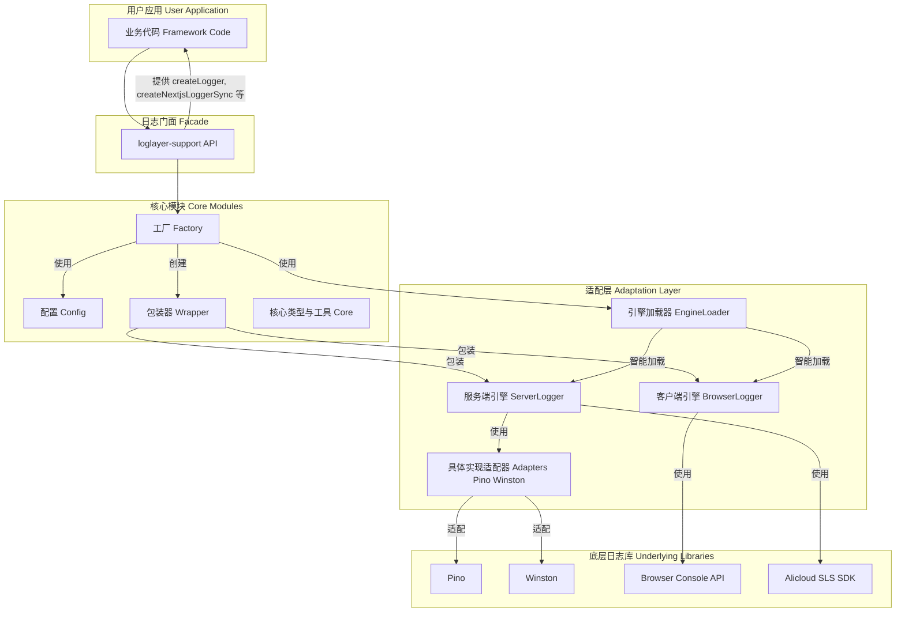
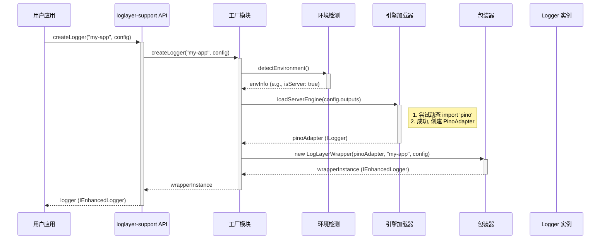
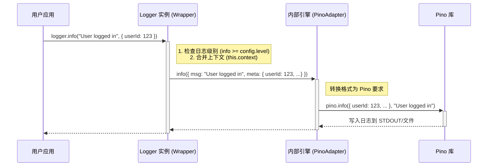
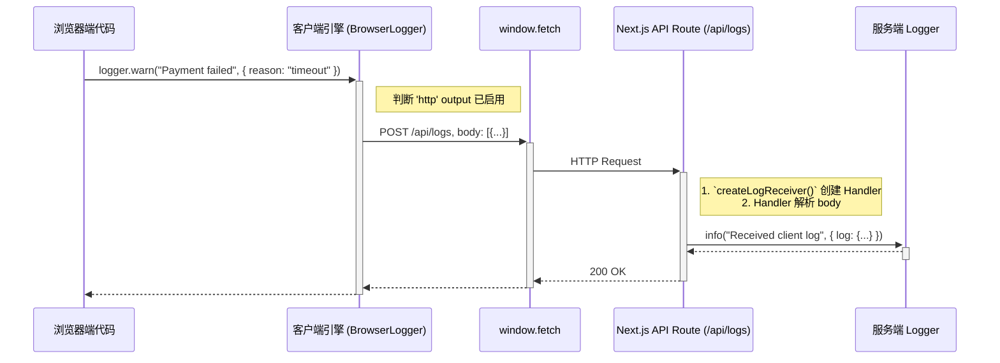

# `loglayer-support` 架构设计文档

## 1. 概述

`@yai-nexus/loglayer-support` 是一个为现代 JavaScript 应用（特别是 Next.js）设计的、统一且高度可扩展的日志解决方案。其核心设计哲学遵循三大原则：

- **统一（Unified）**：提供在不同环境（浏览器、Node.js、Serverless）下一致的日志记录体验和 API。开发者无需关心底层差异，即可实现全栈日志覆盖。
- **解耦（Decoupled）**：通过抽象的适配器和传输器（Transport）层，将业务逻辑与具体的日志实现库（如 Pino, Winston）完全分离。这使得底层技术栈可以被随时替换或升级，而无需修改任何业务代码。
- **易用（User-Friendly）**：提供“零配置启动”的预设（Presets）和高度智能化的工厂函数，极大简化了日志系统的初始化和配置过程。同时，保留了深度自定义的能力，以满足复杂场景的需求。

本文档旨在阐述该库的核心架构、设计决策和关键工作流程，为二次开发、代码维护和社区贡献提供清晰的指导。

## 2. 架构总览

`loglayer-support` 的架构可以被清晰地划分为多个层次，每一层都有明确的职责。这种分层设计保证了系统的高内聚、低耦合和高可扩展性。

### 2.1. 组件图

下图展示了系统的核心组件及其相互关系：

**组件职责说明**：

- **用户应用 (User Application)**：项目的业务代码，通过 `loglayer-support` 的公共 API 来初始化和使用日志功能。
- **日志门面 (Facade)**：暴露给用户的最顶层接口，如 `createLogger()`。它是用户与库交互的唯一入口，隐藏了内部的复杂性。
- **核心模块 (Core Modules)**：
    - **工厂 (Factory)**：负责根据用户配置和当前环境，组装和创建出最终的 Logger 实例。它是整个库的“装配车间”。
    - **配置 (Config)**：处理和验证用户传入的配置对象，提供默认配置，并决定在不同环境下应激活哪些日志输出。
    - **包装器 (Wrapper)**：对内部的日志引擎进行封装，提供一个统一且功能更丰富的 `IEnhancedLogger` 接口，例如支持上下文绑定的 `child()` 方法。
    - **核心类型与工具 (Core)**：定义了系统内所有共享的 TypeScript 类型（如 `LoggerConfig`, `LogLevel`）和公共工具函数（如环境检测 `detectEnvironment()`）。
- **适配层 (Adaptation Layer)**：
    - **引擎加载器 (EngineLoader)**：一个智能模块，能够根据环境（服务端/浏览器）和依赖可用性（例如，是否安装了 `pino`）来动态加载最合适的日志引擎。
    - **服务端/客户端引擎**：分别处理 Node.js 和浏览器环境下的日志逻辑。`ServerLogger` 负责将日志分发给不同的适配器，而 `BrowserLogger` 则负责输出到 Console、LocalStorage 或通过 HTTP 上报。
    - **具体实现适配器 (Adapters)**：将 `loglayer` 的标准日志指令转换为特定底层库（如 `pino`）可以理解的 API 调用。
- **底层日志库 (Underlying Libraries)**：实际执行日志写入操作的第三方库，如 Pino、Winston，或者是浏览器自带的 Console API。

## 3. 核心模块详解

### 3.1. 配置模块 (`src/config`)

配置模块是整个系统的“大脑”，它决定了日志记录器的行为。

- **职责**：
    1.  **提供预设**：`createDefaultConfig()`, `createDevelopmentConfig()` 等函数提供开箱即用的配置方案。
    2.  **配置验证**：`validateConfig()` 确保用户传入的配置对象结构正确。
    3.  **动态决策**：`getEffectiveOutputs()` 根据当前环境（服务端/客户端）从用户配置中筛选出有效的日志输出目标。

### 3.2. 工厂模块 (`src/factory`)

工厂模块是创建 `Logger` 实例的入口点，它编排了整个初始化流程。

- **核心流程 (`createLogger`)**：
    1.  **验证配置**：调用 `config.validateConfig`。
    2.  **环境检测**：调用 `core.detectEnvironment` 来识别当前是浏览器、Node.js 还是 Edge Runtime。
    3.  **创建内部引擎**：调用 `transports.EngineLoader`，根据环境和配置智能加载并创建一个底层的日志引擎实例（`ILogger`）。
    4.  **创建包装器**：将创建好的内部引擎传入 `wrapper.LogLayerWrapper` 的构造函数，生成一个面向用户的、功能增强的 `Logger` 实例。
    5.  **返回实例**：返回包装后的 `Logger`。

### 3.3. 传输器与适配器模块 (`src/transports`)

这是实现环境隔离和库解耦的关键所在。

- **`EngineLoader`**：
    - **环境判断**：首先检查是浏览器环境还是服务端环境。
    - **动态 `import()`**：在服务端，它会尝试动态导入 `pino` 或 `winston`。`canImport()` 工具函数确保只有在包存在时才进行加载，避免了将所有日志库作为硬性依赖。
    - **优先级策略**：Pino 被设定为服务端的首选引擎，因为它以高性能著称。如果 Pino 不可用，则回退到 Winston，最后回退到基于 `console` 的基础实现，保证了在任何情况下日志功能都可用。

- **`PinoAdapter` / `WinstonAdapter`**：
    - 这两个类都实现了统一的 `ILogger` 接口。
    - 它们的职责是将标准的 `log.info({ message, meta })` 调用，翻译成各自库的特定方法，例如 `pino.info(meta, message)`。

### 3.4. 包装器模块 (`src/wrapper`)

包装器为用户提供了最终的、一致的 API。

- **`LogLayerWrapper`**：
    - **统一接口**：实现了 `IEnhancedLogger` 接口，无论底层引擎是 `PinoAdapter` 还是 `BrowserLogger`，用户调用的方法（`info`, `error` 等）都是一致的。
    - **上下文管理**：实现了 `child()` 方法。调用 `logger.child({ requestId: '123' })` 会创建一个新的 `LogLayerWrapper` 实例，该实例会持有 `{ requestId: '123' }` 这个上下文对象，并在后续的所有日志中自动附加它。

## 4. 核心流程分析 (序列图)

### 4.1. 日志初始化流程 (`createLogger`)

**流程解读**：当用户调用 `createLogger` 时，工厂函数首先确定环境，然后委托 `EngineLoader` 加载最合适的底层引擎（在此例中是 `Pino`）。最后，`Wrapper` 将这个底层引擎包装成一个统一的、功能增强的 `Logger` 实例返回给用户。

### 4.2. 日志记录流程 (`logger.info`)

**流程解读**：用户调用 `logger.info` 后，`Wrapper` 首先会进行日志级别检查，并将自己的上下文与当前日志的 `meta` 数据合并。然后，它调用底层引擎（`PinoAdapter`）的 `info` 方法。`PinoAdapter` 则将参数格式化为 `pino` 库所期望的格式，并调用 `pino` 的方法，最终完成日志的物理写入。

### 4.3. 客户端日志上报流程

**流程解读**：当浏览器端的 `logger` 记录日志时，如果 `http` 输出被启用，`BrowserLogger` 会通过 `fetch` API 将日志数据批量发送到指定的后端端点。在 Next.js 示例中，这个端点是一个 API Route，它内部使用服务端的 `Logger` 实例来接收和处理这些来自客户端的日志。

## 5. 未来架构演进

根据 `discuss/refactoring-and-enhancement-plan.md` 文档的规划，`loglayer-support` 的架构将朝着更易用、功能更强大的方向演进。

- **框架适配层 (`src/frameworks`)**：将引入一个新的 `frameworks` 目录，用于存放针对特定框架（如 Next.js、原生浏览器）的高度封装的工厂函数。
- **开箱即用的工厂函数**：
    - `createBrowserLogger`: 封装浏览器端日志的最佳实践，内置会话管理、批量上报、失败重试和 IndexedDB 缓存。
    - `createLogReceiver`: 提供一个标准的 Next.js API Route Handler，用于接收客户端日志。
    - `createServerLogger`: 封装 Node.js 环境下的最佳实践，简化服务端日志初始化。
- **功能增强**：在 `BrowserLogger` 中逐步实现日志批量处理（Batching）、发送失败重试（Retry）和使用 IndexedDB 进行离线缓存，使其功能足以媲美甚至超越传统的 BFF 端日志。

这些演进将使 `loglayer-support` 从一个灵活的底层库，升级为一个功能完备、开箱即用的“日志解决方案”。 