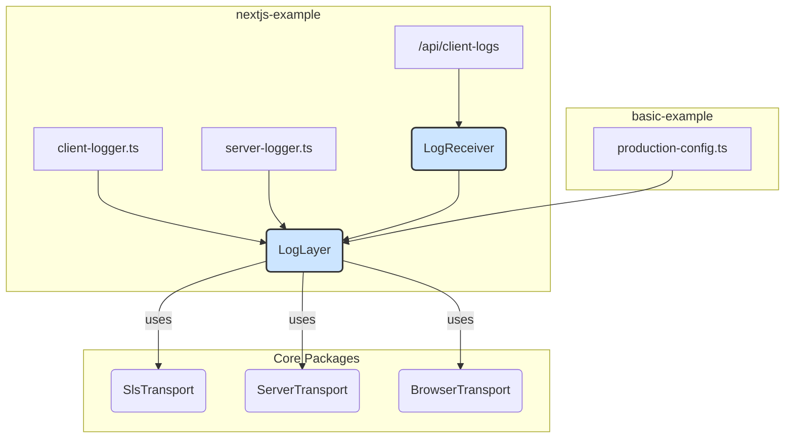
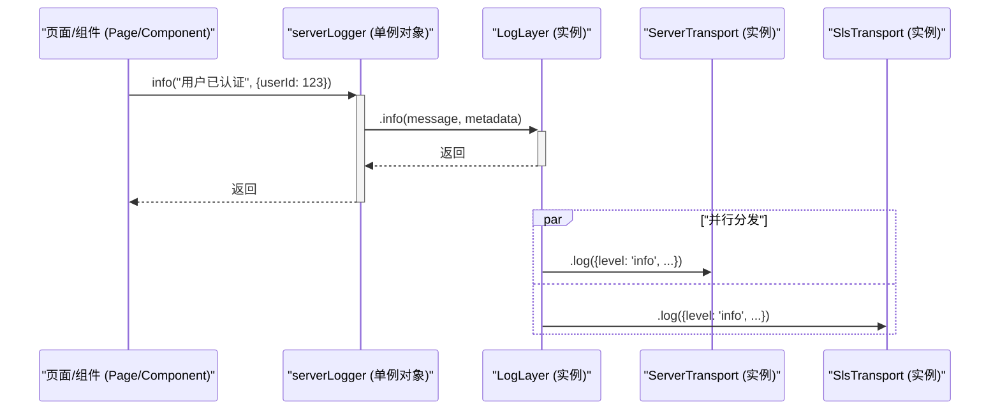
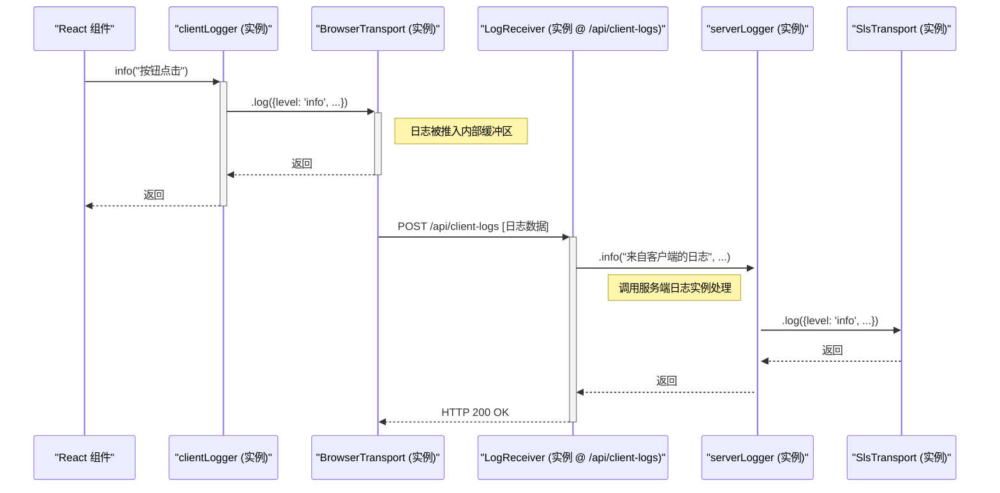
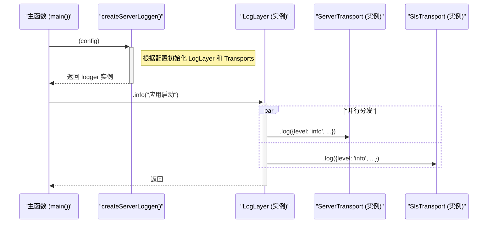

# LogLayer 示例日志实现分析

本文档详细分析了 `nextjs-example` 和 `basic-example` 中日志功能的实现方式，并提供了相应的图表以帮助理解。

## 1. `nextjs-example` 实现分析

`nextjs-example` 展示了一套复杂的日志系统，明确区分了服务端和客户端环境，并实现了两者的联动。

### 服务端日志 (`server-logger.ts`)

- **初始化**: 采用异步、基于 Promise 的单例模式创建 `LogLayer` 实例。这确保了在处理任何服务器请求之前，日志服务已完全配置好。
- **传输器 (Transports)**: 动态配置多个传输器：
  - `ServerTransport`: 用于标准的控制台和文件输出。
  - `SlsTransport`: 用于将日志发送到阿里云 SLS。此传输器会根据环境变量动态加载，如果缺少必要的环境变量，该功能将被禁用，从而提高了应用的健壮性。
- **SLS 集成**: `SlsTransport` 实例被动态创建并添加到 `LogLayer` 的传输器列表中。所有服务端日志（包括从客户端接收的）都会在 `SlsTransport` 启用时自动发送到 SLS。

### 客户端日志 (`client-logger.ts`)

- **初始化**: 使用 `createBrowserLoggerSync` 同步创建日志实例，确保在客户端代码执行时立即可用。
- **输出 (Outputs)**: 配置了多种输出方式：
  - `console`: 输出到浏览器开发者控制台。
  - `localStorage`: 在浏览器本地存储中持久化日志。
  - `http`: 将日志打包发送到服务端的专用接口 (`/api/client-logs`)。

### 日志接收 (`/api/client-logs/route.ts`)

- 该 API 路由使用 `@yai-loglayer/receiver` 包来处理和验证从客户端发送过来的日志数据。
- 接收器与服务端的 `LogLayer` 实例相连。这意味着所有来自客户端的日志，在经过服务端接收和处理后，会被无缝地推送到所有服务端配置的传输器中，包括 `SlsTransport`。这套机制有效地打通了前后端的日志体系。

## 2. `basic-example` 实现分析

`basic-example` 主要演示了服务端的日志配置，实现方式更为直接。

- **初始化**: 直接通过 `createServerLogger` 创建 `LogLayer` 实例。
- **传输器 (Transports)**: 在一个配置对象中静态定义所有输出。
  - `sls` 类型直接在 `outputs` 数组中声明。
  - SLS 的具体配置信息通过一个工具函数 `getSLSConfig` 从环境变量中读取。
- **SLS 集成**: 与 `nextjs-example` 的动态加载不同，这里的 `SlsTransport` 是静态配置的一部分。如果缺少环境变量，可能会在初始化时导致错误。

## 3. 主要差异对比

| 特性 | `nextjs-example` | `basic-example` |
| --- | --- | --- |
| **SLS 配置** | **动态加载**：根据环境变量是否存在动态启用，更灵活、健壮。 | **静态配置**：在初始配置中直接定义，缺少灵活性。 |
| **客户端日志** | **端到端实现**：完整的客户端日志收集、发送、服务端接收和转发流程。 | **仅配置**：只在配置中定义了客户端日志上报，但无实际客户端代码。 |
| **初始化方式**| **异步单例**：更适合 Web 服务器环境，确保日志服务完全就绪。 | **直接创建**：简单直接，适合脚本或简单应用。 |
| **整体架构** | **复杂、环境感知**：为前后端分离的全栈应用设计。 | **简单、服务端聚焦**：主要用于展示服务端的日志能力。 |

## 4. 可视化图表

### 类图 (Class Diagram)

此图展示了两个示例中涉及的主要类及其关系。

### 时序图 (Sequence Diagrams)

为了更清晰地展示模块和类之间的交互，以下是优化后的时序图。

#### `nextjs-example` - 服务端日志流 (详细)

此图展示了从服务端页面/组件发起一次日志记录，直到该日志被分发到不同传输器的完整流程。

#### `nextjs-example` - 客户端日志流 (详细)

此图详细描绘了从浏览器UI事件触发，到日志被发送至服务端，并最终由SLS传输器处理的全过程。

#### `basic-example` - 日志流 (详细)

此图展示了 `basic-example` 中从应用主函数创建日志记录器到分发日志的简化流程。

